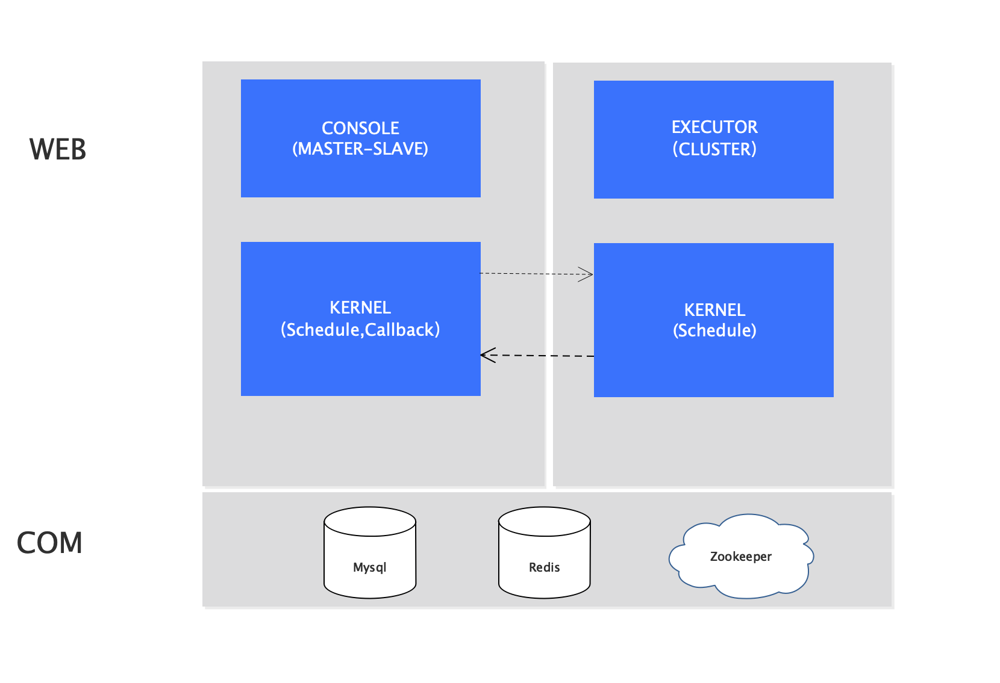
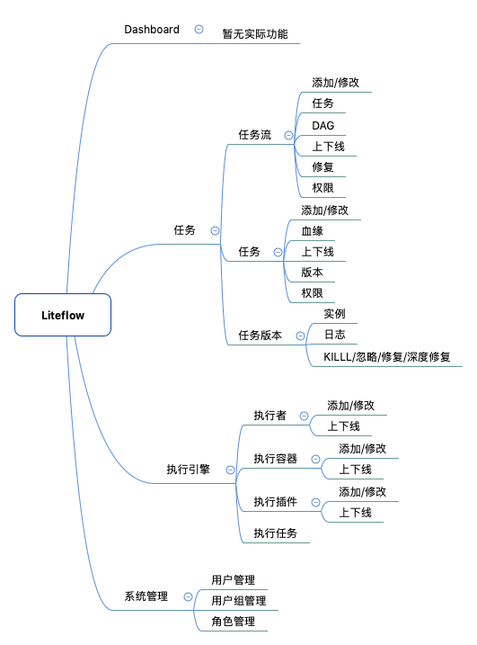

# 一、LiteFlow是做什么的
liteflow是一个基于任务版本来实现的分布式任务调度系统；

1.实现任务在任务流间共享

2.任务/任务流的可视化配置

3.一键修复任务/任务流修复降低数据修复成本

4.提供一个可扩展性比较强的执行引擎，提高灵活性

# 二、LiteFlow项目介绍

## 1.项目主要分为控制台和执行引擎
   ### 1) [控制台(CONSOLE)](docs/md/console.md)
   主要用来配置以及调度任务
   
   
   
   ### 2) 执行引擎(EXECUTOR)
   

# 三、其他
 1.[控制台页面](docs/md/console.md)

 2.[项目运行原理](docs/md/developer.md)

 3.[任务版本&时间计算器](docs/md/task-version.md)

> 静态页面:[http://101.200.43.196:8000/#/login](http://101.200.43.196:8000/#/login)
> 用户名:lite 密码：123456  
> 注：网络带宽比较小，首次加载会比较慢！

# 相关项目
- [dubbo](https://github.com/apache/incubator-dubbo)
- [azkaban](https://github.com/azkaban/azkaban)
