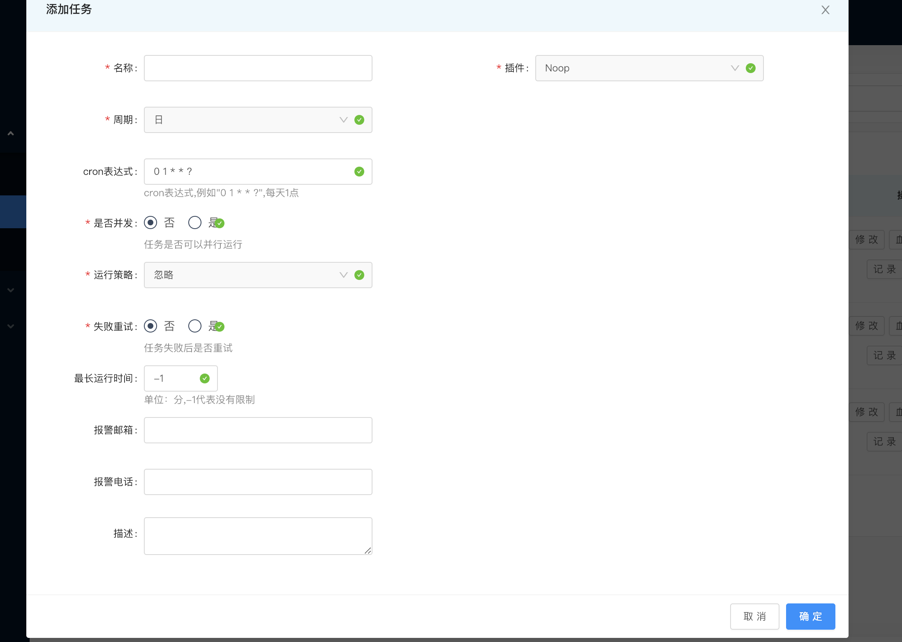
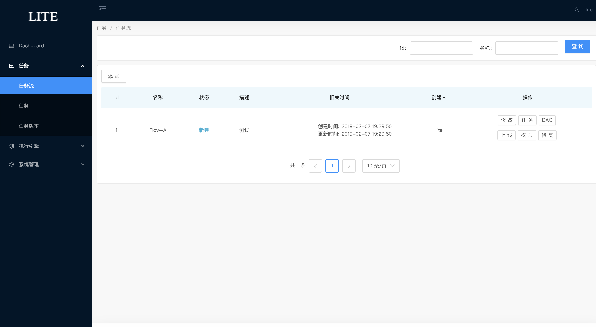
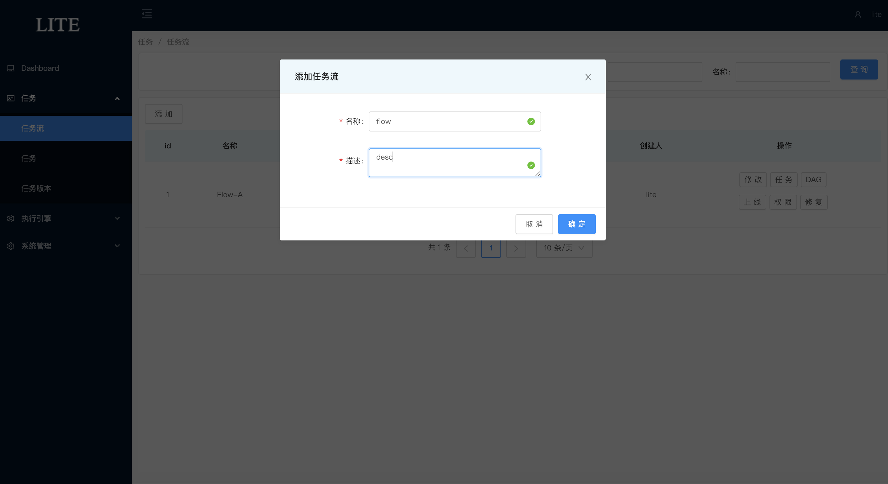
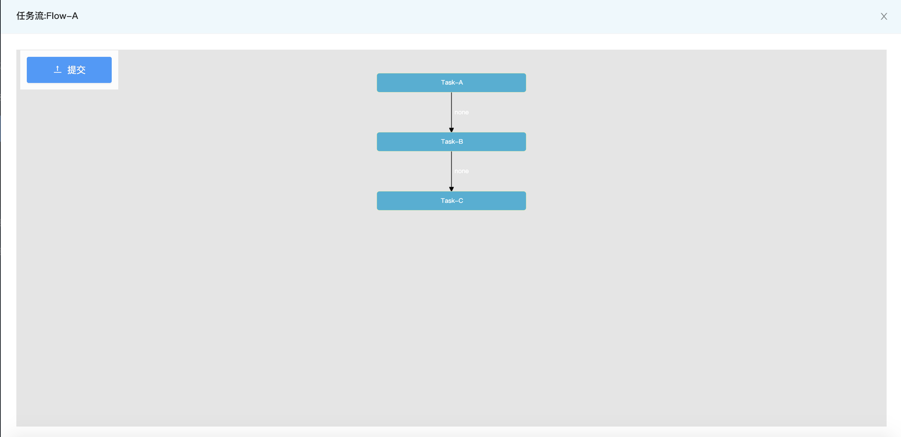
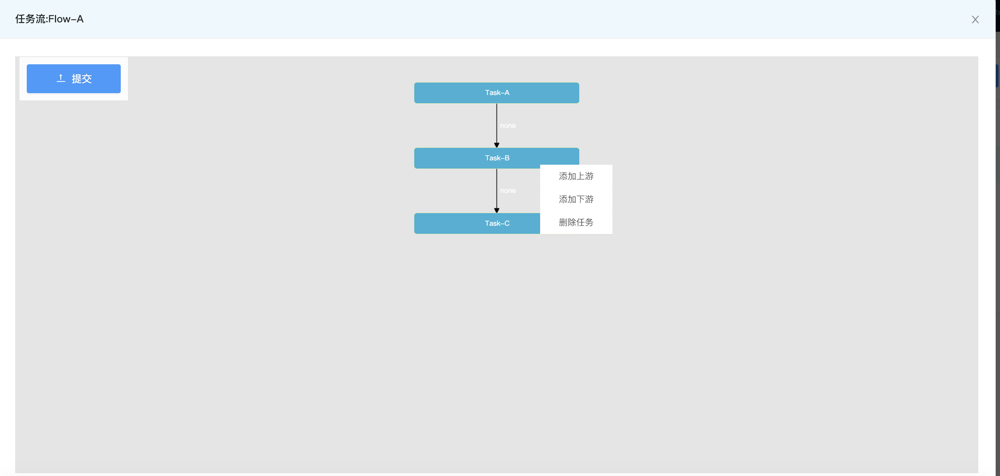
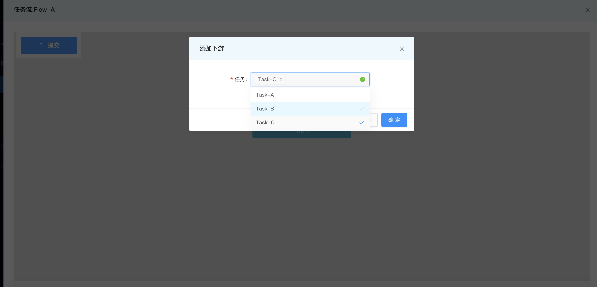

# LiteFlow(Beta)
   基于DAG(有向无环图)的开发的调度系统
# 项目介绍

> 名称：lite-flow
>   
> 语言：java
>   
> 定位： 任务调度系统
>  
> keyword： 调度 / DAG / 任务流 
> 
> 运行环境：
>> jdk: 1.8
>> 
>> zk: 3.4.8
>> 
>> redis: 3.0+
>> 
>> mysql: 5.0+

# 项目模块
##

# 控制台
## 1.登陆

## 2.任务
### 1.任务列表

### 2.添加任务

## 3.任务流
### 1.任务流列表

### 2.添加任务流

### 3.任务流添加任务

# 项目原理
## 1.任务运行原理

## 2.任务状态流转图

# 相关项目
- [dubbo](https://github.com/apache/incubator-dubbo)
- [azkaban](https://github.com/azkaban/azkaban)
