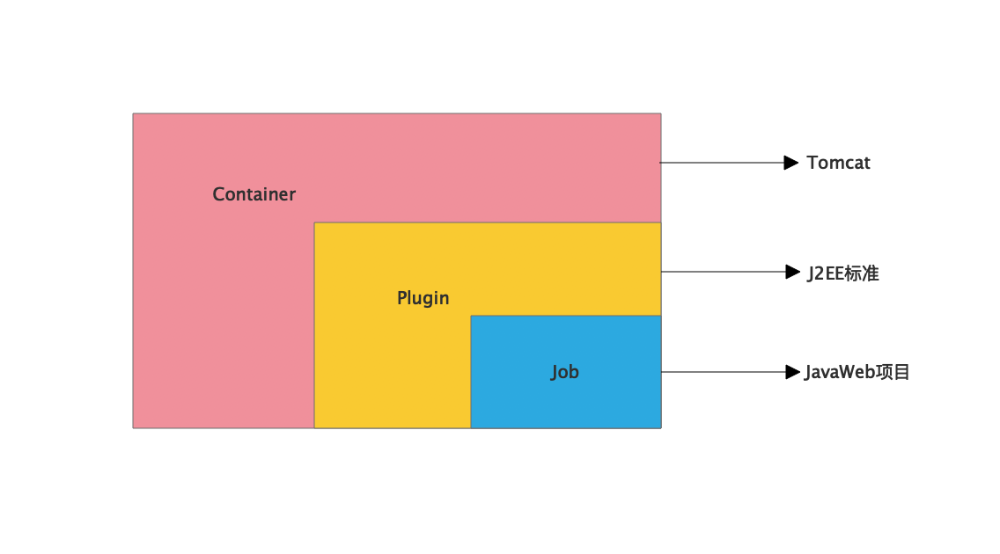
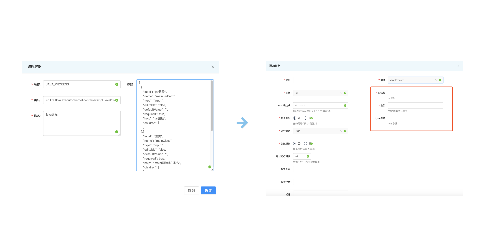

# 容器&插件&动态表单
> 执行者是基于容器的方式来运行任务，每个不同的容器需要的运行参数各不相同，为了避免硬编码，所以容器所需参数可以通过动态表单的方式动态生成提高扩展性
## 一、容器&插件
容器是任务运行的根本单元，容器可以类比于tomcat，插件就是一些定制化的标准，任务就像是不同的web应用

`任务遵循一定的标准（即运行参数）即可运行在容器之中`


## 动态表单
动态表单即根据后台配置自动生成表单页面,以java经常容器为例

```
[
  {
    "label": "jar路径",
    "name": "mainJarPath",
    "type": "Input",
    "editable": false,
    "defaultValue": "",
    "required": true,
    "help": "jar路径",
    "children": [
    ]
  },{
    "label": "主类",
    "name": "mainClass",
    "type": "Input",
    "editable": false,
    "defaultValue": "",
    "required": true,
    "help": "main函数所在类名",
    "children": [
    ]
  },
  {
    "label": "jvm参数",
    "name": "jvmArgs",
    "type": "Input",
    "editable": false,
    "defaultValue": "",
    "required": true,
    "help": "jvm 参数",
    "children": [
    ]
  }
]   
```


### 动态表达参数说明
form参数| 作用 | 说明
-----| ------------- | ------------
 label|表单的显示名称| 
 name|表单的名称，提交是传的参数名| 
 type|表单类型| 现支持：Input、Select
 editable|当前参数编辑状态下是否可以编辑|
 defaultValue|表单项的默认值|
 required|是否必填选项|
 help|表单参数说明（会显示在表单项下方）|
 children|表达选项（主要使用于Select）| [{"id":"1", "name": "fieldName"}]
 

